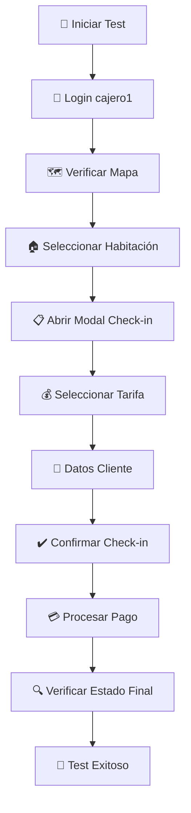

# 🧪 Sistema de Testing Completo - Gestor HR v3.0

## 📋 **Estado del Testing**

### ✅ **Testing Limpio y Estructurado**

- **Tests obsoletos eliminados** - Solo tests relevantes y funcionales
- **Tests básicos funcionales** - Verifican que la aplicación arranca
- **Tests E2E configurados** - Flujo completo de negocio

### 🏗️ **Arquitectura de Testing**

```
tests/
├── test_main.py                    # Tests básicos de funcionamiento
└── e2e/                           # Tests End-to-End con Playwright
    └── test_flujo_checkin.spec.ts # Test principal de flujo de negocio
```

## 🎭 **Tests End-to-End con Playwright**

### **Configuración Completa ✅**

- **Playwright instalado** y configurado
- **TypeScript support** habilitado
- **Chromium browser** disponible
- **Servidor automático** para tests

### **Test Principal: Flujo de Check-in**

El test `test_flujo_checkin.spec.ts` verifica:

1. **🔐 Login** - Autenticación con usuario 'cajero1'
2. **🗺️ Navegación** - Acceso al mapa de habitaciones
3. **🏠 Selección** - Habitación disponible
4. **📝 Check-in** - Formulario completo
5. **💰 Tarifa** - Selección de precio
6. **👤 Cliente** - Datos del huésped
7. **💳 Pago** - Proceso de pago
8. **✅ Verificación** - Estado final correcto

### **Tests Adicionales**

- **Navegación básica** - Elementos UI fundamentales
- **Carga de recursos** - JS/CSS críticos
- **Manejo de errores** - Sin errores JavaScript críticos

## 🚀 **Comandos de Testing**

### **Tests Backend (Python)**

```bash
# Tests básicos
python -m pytest tests/test_main.py -v

# Todos los tests backend
python -m pytest tests/ -v

# Con coverage
python -m pytest tests/ --cov=app
```

### **Tests E2E (Playwright)**

```bash
# Ejecutar todos los tests E2E
npm run test

# Modo interactivo/visual
npm run test:ui

# Modo debug (paso a paso)
npm run test:debug

# Ver reporte de último test
npm run test:report

# Generar código de test (grabación)
npm run test:codegen
```

## 🔧 **Configuración**

### **Usuario de Prueba**

```bash
# Crear usuario para tests E2E
python crear_usuario_prueba.py
```

**Credenciales:**

- **Email:** cajero1@test.com
- **Password:** password123
- **Rol:** Cajero de recepción

### **Playwright Config**

- **Base URL:** http://localhost:8000
- **Browser:** Chromium (optimizado)
- **Screenshots:** Solo en fallos
- **Videos:** Solo en fallos
- **Traces:** En reintentos

## 📊 **Flujo del Test Principal**



## 🎯 **Valor del Testing E2E**

### **Cobertura Completa**

- ✅ **Frontend** - UI, modales, navegación
- ✅ **Backend** - APIs, endpoints, lógica
- ✅ **Base de Datos** - Creación, actualización
- ✅ **Integración** - Flujo completo

### **Confianza Máxima**

Un solo test que pasa = **Sistema funcionando end-to-end**

### **Detección Temprana**

- Errores de integración
- Problemas de UI
- Fallos en APIs
- Issues de navegación

## 🚦 **Estados del Test**

### ✅ **Test Pasa**

- **Sistema funcionando** correctamente
- **Flujo completo** operativo
- **Integración exitosa** entre capas

### ❌ **Test Falla**

- **Logs detallados** de cada paso
- **Screenshots** del punto de fallo
- **Video** del flujo completo
- **Traces** para debug

## 📈 **Próximos Pasos**

### **Tests Adicionales Recomendados**

- **Flujo de Check-out** completo
- **Gestión de pedidos** TPV
- **Reportes** y estadísticas
- **Gestión de usuarios** admin

### **Mejoras Futuras**

- **Tests de performance** (load testing)
- **Tests de accesibilidad** (a11y)
- **Tests mobile** responsive
- **Tests de API** específicos

## 🛡️ **Sistema Robusto**

Con este sistema de testing, el **Gestor HR v3.0** cuenta con:

1. ✅ **Tests básicos** - Arranque y estructura
2. ✅ **Tests E2E** - Flujo completo de negocio
3. ✅ **Usuario de prueba** configurado
4. ✅ **Pipeline automatizable** - CI/CD ready
5. ✅ **Documentación completa** - Uso y mantenimiento

**¡El sistema está listo para evolucionar con confianza!** 🎉
